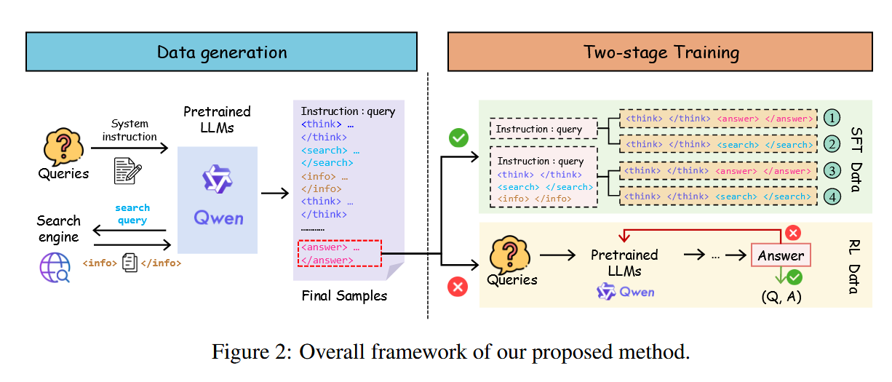
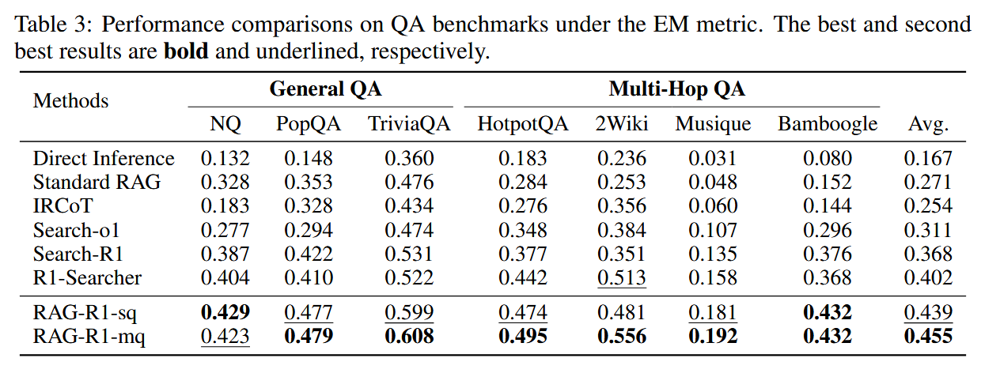
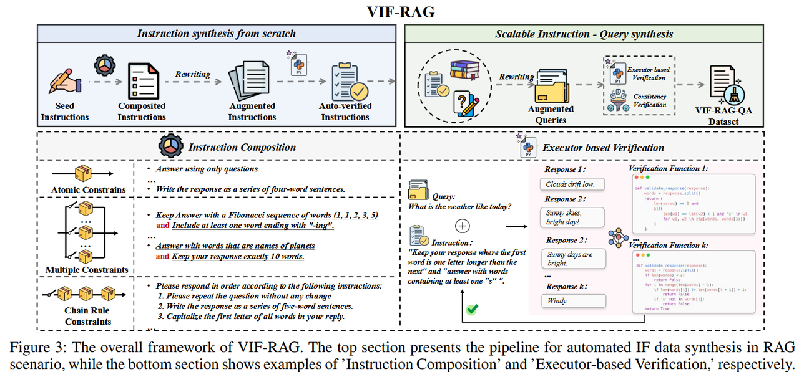
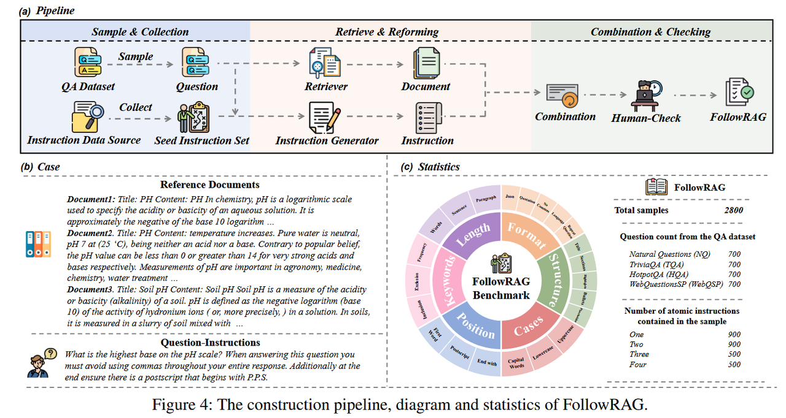
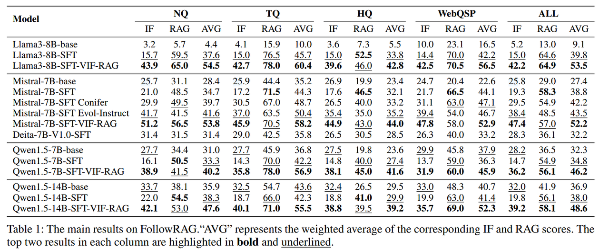
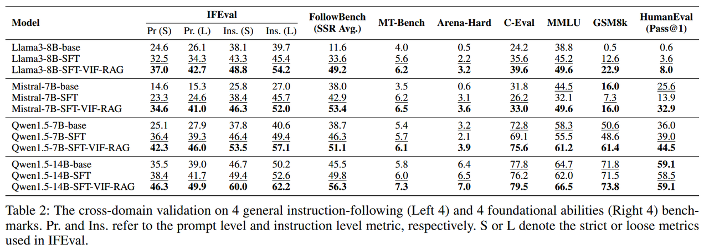

# Retrieval-Augmented Generation
## RAG-R1 : Incentivize the Search and Reasoning Capabilities of LLMs through Multi-query Parallelism

AI [gpt](https://chatgpt.com/c/68ef4928-c1c0-8321-a95b-59dc287d6d27)
[豆包](https://www.doubao.com/chat/24645709807347970)
### RAG产生背景
响应质量问题：LLMs 的内置知识固定于训练数据截止时间，无法实时更新，在处理复杂问题或实时场景时，易生成幻觉内容（虚假信息）或过时响应，例如对近年事件的回答仍依赖旧数据，或编造看似合理却无事实依据的结论。

适应性不足：静态知识导致 LLMs 难以应对训练数据之外的新场景、新领域，面对需要动态外部知识支撑的任务（如多跳推理、时效性强的事实查询）时，能力边界受限，无法灵活补充所需信息。
### 传统RAG局限
早期 RAG（基于提示工程）：聚焦通过提示策略（如问题分解、查询重写、多轮检索）引导 LLMs，虽能一定程度结合外部知识，但过度依赖人工设计的提示，灵活性差，难以适配复杂多变的任务场景，且提示质量直接决定效果，可扩展性低。

近期 RAG（融合推理能力）：通过将 RAG 与思维链（CoT）结合实现分步检索，或通过监督微调（SFT）让模型学习 “推理 - 检索” 链路，但这类方法易导致模型记忆固定解决方案路径，无法泛化到未见过的新场景，例如仅能处理训练过的特定类型多跳问题，面对新领域多跳任务时性能骤降。
### RL-based RAG存在的问题
训练稳定性差：依赖 “冷启动模型”（初始状态的模型）开展 RL 训练，而冷启动模型的检索与推理能力有限，导致 RL 训练过程波动大、难以稳定收敛。

单查询模式的效率与知识局限：现有方法在需要外部检索时仅生成单个查询，引发两个问题：一是处理多跳推理等复杂任务时，需多轮 “推理 - 单查询 - 再推理” 交互，导致推理时间长，无法满足实时应用需求；二是单次检索获取的知识有限，限制模型在训练中探索推理能力的边界，最终影响整体性能。

### 论文所做贡献
提出全新训练框架 RAG - R1，使大语言模型（LLMs）能在推理过程中自适应利用内部和外部知识，提升正确回答问题的推理能力。

将框架内的生成与检索过程从单查询模式拓展为多查询并行模式，既减少了模型的检索轮次和推理时间，又进一步提高了模型性能。

### SFT阶段
#### 类别 A：仅推理并给出答案（Think → Answer）

用途：教模型在已有内部知识足够时如何直接从 <think> 到 <answer>，即学会“用内部知识推理并给出答案”。

Input（上下文）：Question + 已有对话上下文（可能包含先前的 <think> 和 <information>）

Target（模型输出）：<think> ... </think> <answer> ... </answer>

示例模板：

Input: Question: Which magazine was started first Arthur’s Magazine or First for Women?

Target: <think> Compare founding years: Arthur’s 1844, First for Women 1978. </think><answer>Arthur’s Magazine</answer>

要点：输出不包含任何 <information>（若上下文里有检索结果，训练目标仍只要求模型生成推理和答案，不要求复述检索文档）。

#### 类别 B：推理 → 发起检索（不立刻给答案）（Think → Search）

用途：教模型在“内部知识不足”时何时、如何构造检索查询（即学会提出有效的 search query）。

Input（上下文）：Question + 之前的 <think> 推理（说明为什么需要更多信息） +（可含已存在的 <information>）

Target（模型输出）：<search> query1 [, query2, ...] </search>

示例模板：

Input: Question: ... <think> I need founding years but not in my parametric memory. </think>

Target: <search> Arthur’s Magazine founding year, First for Women founding year </search>

要点：训练模型学会如何把推理中的知识缺口转成检索语句；这类样本不会要求模型在该轮给出最终答案（答案将由后续轮次结合检索内容生成）。

#### 类别 C：（含检索信息）推理并给答案（Think + Info → Answer）

用途：教模型如何在获得外部信息后进行基于外部信息的推理并给出答案（学会整合检索结果进行决策）。

Input（上下文）：Question + （之前的）<think> + <search> + <information>（检索返回，供上下文参考）

Target（模型输出）：<think>（基于 <information> 的推理）</think><answer> ... </answer>

示例模板：

Input: Question ... <think> need founding years </think><search> ... </search><information> Doc: Arthur’s Magazine (1844-1846); Doc: First for Women (1978) </information>

Target: <think> Arthur's 1844 < First for Women 1978, so Arthur's Magazine started earlier. </think><answer>Arthur’s Magazine</answer>

要点：虽然检索文档出现在输入中，但训练目标仍仅要求模型生成推理与答案，不要求输出检索文本本身（从而抑制盲目复述 retrieved docs）。

#### 类别 D：（含检索信息）推理 → 再次发起检索（Think + Info → Search）

用途：教模型在已有外部信息仍不足或需要对齐更多证据时，如何基于现有信息重写/扩展检索查询并再次检索（多轮检索策略）。

Input（上下文）：Question + <think> + <search> + <information>（已有检索结果）

Target（模型输出）：<think>（说明现有信息为何还不够）</think><search> new_query1 [, new_query2] </search>

示例模板：

Input: ... <search> query1 </search><information> Doc1 ... ambiguous </information><think> Doc1 ambiguous; need authoritative founding year sources. </think>

Target: <search> "Arthur's Magazine founding year primary source", "Arthur's Magazine publication dates" </search>

要点：训练模型学会基于已检索证据决策下一步检索要点，从而支持多查询/多轮检索策略。

### RL阶段
#### 样本筛选
初筛：选 SFT 样本生成环节中回答错误的样本，因这类样本对应模型能力短板（如未判断需检索、生成无效查询），具备挑战性，能通过 RL 优化直接提升核心能力。
过滤：剔除本质不可回答的样本排除因客观条件导致错误的样本：如检索数据不完整（维基语料无关键信息）、模型固有局限（极端复杂问题），这类样本无法通过 RL 优化解答，会混乱训练信号，仅保留 “优化后可正确解答” 的样本。
验证：多轮 Rollout 确认可回答性对 Qwen2.5-72B-Instruct 用随机采样验证，关键参数：采样温度 1.2（保证生成多样性且不无序）、最大检索次数 10（模拟真实资源约束）；每问题最多 10 轮 Rollout（完整 “推理 - 检索” 流程），仅保留 10 轮中至少 1 轮能正确解答的样本。
补充：从 3.1.1 节随机选 25% SFT 正确样本，平衡数据集难度，避免训练震荡，提升稳定性。
最终 RL 训练数据集由 “2488 个挑战性可回答样本 + 25% SFT 正确样本” 构成。
#### 训练

RL阶段的核心是让模型在与外部检索系统（R）的交互中，优化“推理-检索”决策能力，目标通过定制化目标函数实现：
1. **目标函数构成**：公式（1）以“最大化期望奖励-最小化策略偏差”为核心，即最大化模型在数据集D上的平均奖励（$\mathbb{E}_{x \sim D,y\sim \pi_{\theta}(\cdot | x;\mathcal{R})}\left[r_{\phi}(x, y)\right]$），同时通过KL散度（$\mathbb{D}_{KL}\left[\pi_{\theta}(y | x; \mathcal{R}) \parallel \pi_{ref}(y | x; \mathcal{R})\right]$）和权重β约束策略模型（$\pi_{\theta}$）与参考模型（$\pi_{ref}$）的差异；
2. **关键变量作用**：策略模型$\pi_{\theta}$是待优化的LLM（参数为θ），参考模型$\pi_{ref}$由SFT模型初始化（固定参数，避免$\pi_{\theta}$优化过度偏离）；x是从RL数据集D中抽取的输入样本，y是包含“LLM生成tokens+检索系统返回tokens”的完整推演序列（rollout序列），$r_{\phi}(x,y)$是评估y准确性的奖励函数。

3. 序列生成（Rollout）：模拟“推理-检索”交互
模型针对输入x生成y的过程（rollout）严格遵循3.1.1节SFT样本生成的“think-then-search”流程：先在``标签内完成内部推理，若需外部知识则在`<search>`标签内生成查询，检索系统R返回文档并以`<information>`标签融入序列，模型基于新信息继续推理，直至生成``标签内的最终答案，形成包含“可训练的生成tokens”与“不可训练的检索tokens”的y序列。

4. 检索掩码损失（Retrieval Masked Loss）
为避免检索系统返回的tokens干扰模型自身推理与生成能力，训练时仅对LLM生成的tokens计算策略梯度目标，对检索tokens实施“掩码”——不将其纳入优化过程，既保留检索增强生成的优势（补充外部知识），又防止模型误将检索内容当作“可优化目标”，保障训练稳定性。

5. 奖励建模（Reward Modeling）
采用基于最终答案准确性的规则化奖励，不额外设计格式奖励或神经奖励模型：
- 奖励计算：通过公式（2）的精确字符串匹配（EM）评分确定$r_{\phi}(x,y)$，即从y中提取的预测答案$a_{pre}$与真实答案$a_{gold}$完全一致时，奖励为1，否则为0；
- 设计理由：SFT阶段已让模型掌握“think-then-search”格式，无需格式奖励；不使用神经奖励模型可避免“奖励作弊”（模型拟合奖励模型缺陷而非提升真实能力）与额外计算成本。

### RAG-R1框架中多查询并行（Multi-Query Parallelism）

尽管RAG-R1通过两阶段训练（SFT+RL）让模型能自适应利用内外部知识，但现有方法在需外部检索时仅生成**单个查询**，存在两大关键问题：
1. **推理效率低**：单查询需多轮“推理-检索-再推理”交互（尤其处理多跳、比较类问题时），导致检索迭代次数多、整体推理耗时久；
2. **知识获取有限**：单次检索仅能获取少量信息，限制模型对外部知识的探索深度与广度，进而制约推理能力提升。  
为解决上述问题，RAG-R1将生成与检索过程从单查询模式扩展为**多查询并行**，实现“效率与能力双优化”。

当模型通过推理判断需外部知识时，不再生成1个查询，而是在遵循“think-then-search”格式的基础上，**一次性生成多个查询**（需先在``内完成推理，明确需补充的知识维度）；外部检索系统接收多个查询后，通过“并行检索”同时获取每个查询对应的文档，并以特定格式返回给模型，形成“单轮交互获取多维度知识”的流程，替代传统单查询的“多轮交互”。

- **查询数量限制**：为平衡“知识覆盖度”与“检索成本”，限制模型单次最多生成**3个并行查询**，避免因查询过多导致检索效率下降或信息冗余；
- **结果返回格式**：检索系统以**JSON格式**返回结果，确保“查询-文档”一一对应，格式包含两大核心字段：
  - `query`：模型生成的多个查询组成的列表；
  - `documents`：与每个查询对应的检索文档列表（如“query1”对应“document1”，“query2”对应“document2”），帮助模型清晰识别不同查询的知识来源，避免混淆；
- **系统指令约束**：通过Table 2中的系统指令明确格式要求——查询需用`<search>query1,query2</search>`包裹（多查询用逗号分隔），检索结果用`<information>`标签包裹，最终答案仍需在``内输出，确保与SFT阶段的格式兼容，不额外增加模型学习成本。

### 结果

## Toward General Instruction-Following Alignment for Retrieval-Augmented Generation
### 一、研究背景与核心问题
1. RAG 系统的局限
  - 局限：现实场景中用户指令多样（如格式、语义约束），但现有研究中 RAG 系统的指令遵循（IF）对齐能力评估与优化严重不足，且 LLM 在 RAG 场景下的 IF 能力难以泛化，甚至与基础能力（如数学推理）冲突
2. 关键研究问题（RQ）
  - RQ1：如何全面评估 RAG 场景下 LLM 的复杂指令遵循能力？
  - RQ2：如何在 RAG 系统中实现可扩展、可靠的 IF 对齐，同时避免与模型基础能力冲突？
### 二、方法框架：VIF-RAG
VIF-RAG 是一种自动化、可扩展、可验证的指令合成与对齐数据生成框架。

### 三、VIF-RAG数据集构建流程：
1.手动构建原子指令种子集
原子指令指 “仅包含单一约束要求” 的基础指令，论文按 “用户真实需求场景” 将其归为 4 类约束，每类约束有明确的设计标准，分为 
格式约束（Format）
语义约束（Semantic）
知识约束（Knowledge）
词汇约束（Lexical）
标注员为上述 4 类约束每类设计 15 条原子指令，最终形成  原子指令种子集，总规模小于100条。
2.合成并验证复杂指令
论文设计两种自动化组合策略，生成覆盖不同复杂度的指令：
- 策略 1：多约束组合（Multiple Constraints）从原子指令种子集中随机抽取 2-3 条原子指令，插入预设的约束模板中直接拼接，形成 “包含双重 / 三重约束的复杂指令”。例如，将 “用 JSON 格式输出”（格式约束）与 “包含‘人工智能’关键词”（词汇约束）组合，得到 “用 JSON 格式输出，并确保包含‘人工智能’关键词”。这类指令要求模型同时满足多个约束。
- 策略 2：链式约束组合（Chain Rule Constraints）设计 “顺序条件模板”，从原子指令种子集中选择指令，形成 “需按步骤完成的任务链”。形式上，链式约束包含n个任务，要求模型按顺序完成所有任务。例如，“第一步：重复用户的问题；第二步：用 3 个句子回答；第三步：将回答首字母全部大写”。
验证方法：
- 使用一个鲁棒的监督模型（后续明确为 GPT-4-turbo）对组合后的复杂指令进行 “一致性评分”，评分范围 1-10 分。仅保留评分≥8 分的复杂指令，形成 “复杂指令种子集“，最终将原子指令种子集与复杂指令种子集合并，得到 “初始指令种子集”
3.重写指令并验证质量
- 重写策略：使用监督模型（GPT-4-turbo），以初始指令种子集为基础，进行批量重写，生成 “扩展指令集”。
- 去重合并：将初始种子集与扩展指令集合并，去除重复样本，得到 “合并指令集”，实现指令数量的规模化增长。
  验证方法：
  自动生成验证代码与测试用例
 对每条合成后的指令，模型会自动写出对应的验证函数（如检查关键词数是否达标）和一组测试样例（包含符合和不符合要求的文本），形成验证数据集。
  用 Python 执行器自动跑验证
 将这些函数和样例送入执行器，判断验证是否通过。
 通过即记 1 分，未通过或出错记 0 分，从而量化每条指令的“可验证性”。
  用交叉指标筛掉不可靠的指令
 通过统计函数和测试用例的平均通过率，只保留可靠性和有效性都超过阈值0.5的指令，其余全部丢弃。
4.构建完整的指令 - 查询 - 文档’三位一体的高质量数据集（VIF-RAG-QA）
通过前面的操作，系统已拥有自动验证后的高质量指令集，本阶段的目标是：
将这些指令与真实 RAG 查询（Query）及检索文档（Documents）结合，构建可直接用于 RAG 场景指令遵循（IF）对齐训练的数据集。
1. RAG 领域（知识密集型任务）
- 目标：生成适用于知识检索型任务的指令-查询-文档样本。
- 流程：
  - 提取查询：从多个 QA 数据源（如 Natural Questions、HotpotQA、WebQuestionsSP）中随机抽取查询，覆盖开放域、多跳和知识库 QA 场景。
  - 检索文档：使用 DPR 密集检索器从知识库（如 Wikipedia、Freebase）检索 Top-K 相关文档，形成 (qi,Di)(q_i, D_i)(qi,Di) 对。
  - 组合样本：将每条指令与若干“查询-文档”对随机组合，生成包含指令约束的 RAG 样本集 DIF−RAGD_{IF-RAG}DIF−RAG。
例如：“用三段话总结” + “光合作用是什么” + 三篇相关文档 → 一个完整 RAG 训练样本。
2. 通用领域（日常交互任务）
- 目标：为系统增加基础交互能力。
- 数据来源：使用 ShareGPT 数据集，覆盖真实多轮对话。
- 组合方式：与 RAG 领域相同，将指令与随机选取的日常查询组合，生成 DIF−GeneralD_{IF-General}DIF−General。
将 RAG 与通用领域的样本合并，去重后得到VIF-RAG的一部分数据集，但由于在加入指令约束后，原始 QA 数据的标准答案往往不再符合要求。
 例如，查询要求写一篇传记，但指令限制“用 5 个词回答”，原答案即失效。
解决方法：
- 使用监督模型（GPT-4-turbo）对每个 “指令 - 查询（- 文档）” 组合生成 K 个符合指令约束的响应，构成集合。
5.双阶段验证VIF-RAG-QA数据集
1. 执行器验证（Executor-based Verification）
- 目标：判断响应是否真正符合指令约束。
- 做法：直接复用第一阶段生成的验证函数，对每个样本的 K 个候选响应进行自动化检查。
- 筛选标准：要求至少有一个响应在验证中通过阈值，否则丢弃样本。
2. 一致性验证（Consistency Verification）
- 目标：排除指令与查询语义冲突的无效样本。
- 做法：用监督模型对“指令 - 查询”的匹配程度打分（1~10分）。
- 筛选标准：仅保留得分≥8分的样本，冲突样本直接剔除。
 例如：长篇传记类查询 + 严格限词指令 = 冲突 → 删除。
 
### 四、FollowRAG 基准测试集构建
大体思路与训练集相似

1. 指令收集与筛选（Instruction Collection & Extraction）
  - 从现有指令遵循数据集（如 IFEval、FollowBench）中收集原子指令；
  - 通过规则和代码自动化验证，剔除与 RAG 场景无关的指令；
  - 最终保留 22 类原子指令，覆盖：
    - 语言与词汇约束
    - 字数/长度约束
    - 结构与格式约束
    - 关键词约束等。
2. 指令重构（Instruction Reforming）
  - 从 QA 数据集随机抽取一个查询（query）。
  - 随机抽取 n 条原子指令（n ∈ [1, 4]），这样一条指令就可能包含 1~4 个不同的约束。
  - 冲突检测：确保这些指令不互相矛盾（例如，“用中文回答”不能和“用英文回答”同时出现）。
  - 使用 GPT-4o 生成自然语言版本的复杂指令：
    - 给 GPT-4o 提供示例（few-shot）
    - 让它根据 n 条原子指令写出一个 自然语言、真实用户风格的复合指令
    - 同时生成 评估参数（便于后续判断模型是否遵循了每条指令）
3. 指令 - 查询 - 文档组合（Combination）
  - 将查询与指令自然融合为一个完整的指令-查询段落；
  - 使用检索器（如 DPR）获取与查询相关的 Top-K 文档；
  - 将检索文档与指令-查询段落拼接，形成完整的 FollowRAG 样本输入。
### 五、测试结果：
在“RAG 场景专属指令遵循评估（FollowRAG）”和“跨领域通用能力验证”两个部分进行测试，分别如下

