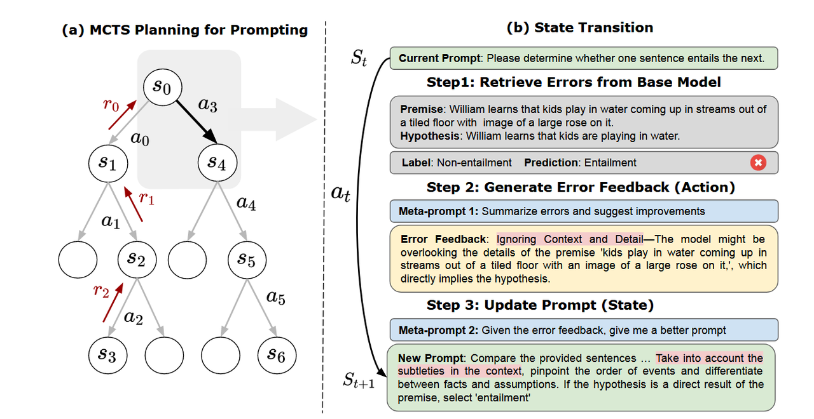

# 多模态

CoT

## PromptAgent: Strategic Planning with Language Models Enables Expert-level Prompt Optimization

### 2.1 研究背景与挑战
当前大语言模型（LLM）的高效任务提示需专家结合LLM 直觉与任务领域知识人工设计，但自动生成专家级提示面临三大核心挑战：
- 现有提示优化方法（如 APE、GPT Agent）多采用启发式策略（文本编辑、 paraphrasing），忽略领域知识深度，仅能生成普通用户提示的局部变体，无法达到专家级水平，可能局限于局部最优而非全局最优
- API 型 LLM（如 GPT-4）因无法获取内部梯度，提示工程依赖人工交互，成本高且难以同时处理多类错误，可扩展性差。
### 2.2 核心创新点：
PromptAgent 提出了一种基于智能体（Agent-based）的框架，
利用strategic planning与error feedback reflectiong机制，实现专家级 prompt 优化。
核心：
让模型在优化过程中学会“反思自己的错误”，用这些错误反馈引导 prompt 迭代，并通过规划算法（如 MCTS）在 prompt 空间中平衡“探索”与“利用”。
### 2.3 算法：
(a)图是整体的MCTS的搜索架构，（b）图是某两个状态之间转化的具体过程，如图是从St采取at策略到St+1状态。下面先讲局部的（b）图内容，即文中所称的error feedback reflection，再讲解（a）图内容，即strategic planning。

#### 2.3.1 Error feedback reflection
需要两个模型，一个是实际使用的模型（论文示例给的是gpt-3.5-turbo），我们要优化它的prompt（以便区分命名为p0；另一个被称为优化器模型（示例为GPT-4），人工设计两个Meta-prompt，Meta-prompt1让优化器模型分析实际模型产生的错误原因和优化策略，Meta-prompt2让优化器模型综合p0和前面的错误原因，产生新的我们需要的prompt（称为p1），从而实现从State0到State1，即p0到p1的一个优化。
步骤 1：从基础模型中检索错误（Retrieve Errors from Base Model）
- 输入：当前状态(S_t)（即当前提示p0，图中 “Please determine whether one sentence entails the next.”）和训练样本（前提 - 假设对及正确标签）。
- 操作：将 “当前提示 + 训练样本” 输入基础模型（GPT-3.5），让模型生成预测结果。
- 结果：对比 “模型预测”与 “真实标签”，发现错误即需要优化
步骤 2：生成错误反馈（动作，Generate Error Feedback (Action)）
- 将 “模型错误 + 元提示 Meta-prompt1” 输入优化器模型（GPT-4），利用其自我反思能力分析错误根源。
- 结果：生成 error feedback ，即对提示的改进建议。示例，错误反馈指出模型 “忽略了前提中的细节（如‘水流来自带玫瑰图案的瓷砖地板’）”，并暗示需要更关注上下文细微差别。
步骤 3：更新提示（新状态，Update Prompt (State)）
- 输入：当前提示(S_t)、错误反馈(a_t)、元提示(m_2)（图中“Given the error feedback, give me a better prompt”）
- 操作：将 “当前提示 + 错误反馈 + 元提示(m_2)” 输入优化器模型，让其基于错误反馈重构提示。
- 结果：生成新提示(S_{t+1})（新状态）。如图中示例，新提示明确要求模型 “关注上下文细微差别、区分事实与假设、梳理事件顺序”，从而避免之前的错误，完成一次状态转移。
#### 2.3.2 strategic planning
思路是用MCTS对整个空间进行有侧重的搜索，防止像以前方法中的本地变体prompt掉入局部最优解。
- MCTS迭代操作(就是普通的MCTS，基本没有变化）
  - 选择（Selection）：从根节点开始，利用 UCT 算法在每一层选择最有希望的子节点，直到叶子节点。UCT 算法平衡了利用（选择高Q值节点）和探索（选择访问少的节点）。UCT算法如下图，Q值项代表该状态动作预期价值，第二项分子lnN(s_t)指父节点的访问次数，分母值父节点采用at的动作得到子节点的次数，c为常数，越大代表越倾向于探索，越小代表越倾向于利用，

  - 扩展（Expansion）：对选择步骤到达的叶子节点添加新子节点，通过多次执行动作生成和状态转移得到多个新动作和状态，采样多批训练数据获取多样错误反馈，然后将最高奖励的新节点送入模拟步骤。
  - 模拟（Simulation）：对扩展步骤选中的节点模拟未来轨迹，为降低计算成本，迭代执行扩展步骤直到终端状态，过程中持续生成多动作并选最高奖励节点推进。
  - 回溯（Back - propagation）：当模拟遇到终端状态（达到预设最大深度或满足早停准则），沿根到终端节点的路径反向传播未来奖励，聚合从该状态开始的所有未来轨迹奖励来更新Q函数。reward根据每个任务自身来确定，如F1分数，准确率等等。
- 迭代与输出：PromptAgent 按预定义迭代次数执行四大操作以稳定Q值、充分生长树。最终选择策略为选取最高奖励路径中最佳节点对应的提示作为输出，该策略在实验中效果最佳。
### 2.4 实验：
三组实验，分别证明三个问题
1. 有效性：PromptAgent 生成的提示是否在性能上超越人类提示、思维链（CoT）提示及现有自动优化方法（如 APE）？
2. 泛化性：优化后的提示能否迁移到不同基础模型（如从 GPT-3.5 迁移到 GPT-4、PaLM 2）？
3. 效率性：PromptAgent 探索提示空间的效率是否高于传统搜索方法（如 Greedy、APE）？
第一组实验，与人类提示zero shot和few shot对比，与CoT、GPT-Agent，APE方法对比

第二组实验，证明实验架构可泛化，论文里提出在PaLM 2中某些效果不好，解释为模型简单，无法完全理解prompt。

第三组实验，证明搜索空间的效率与精确度。
